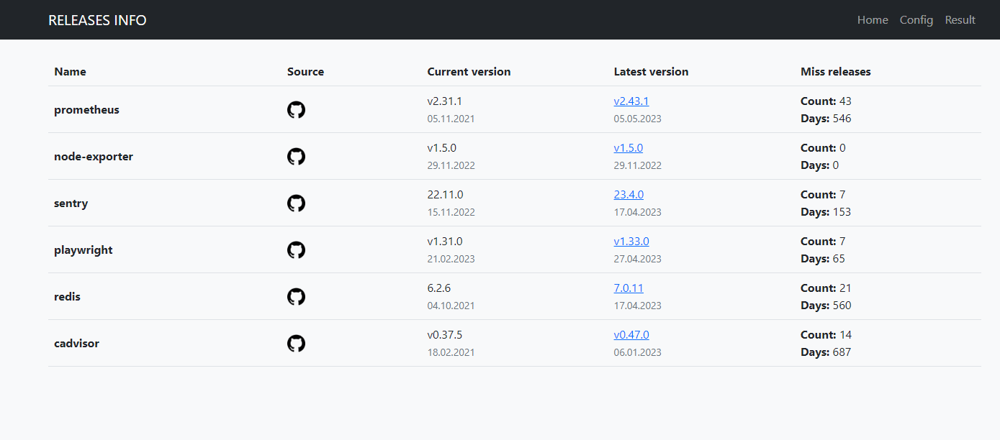

# Releases info for projects list

The service checks new versions of your projects and shows how far behind we are in terms of releases

<!-- <br> -->


At the moment it only works with github (projects where there is a release list) there are plans to add Docker hub check images

# Configuration

Change config.yaml file:

example:

```yaml
services:
  sentry:
    github:
      owner: getsentry
      repo: sentry
    version: 22.11.0
```

# Run

copy .env.example and add your github token to .env file

```
cp .env.example .env
```


run docker-compose

```
docker-compose up -d
```


# To Do
 - Add source Docker HUB
 - Telegram notifications about new releases
 - Auto parsing current version projects from iac repo
 - Improve Frontend, use React
 - MB need to add a database
